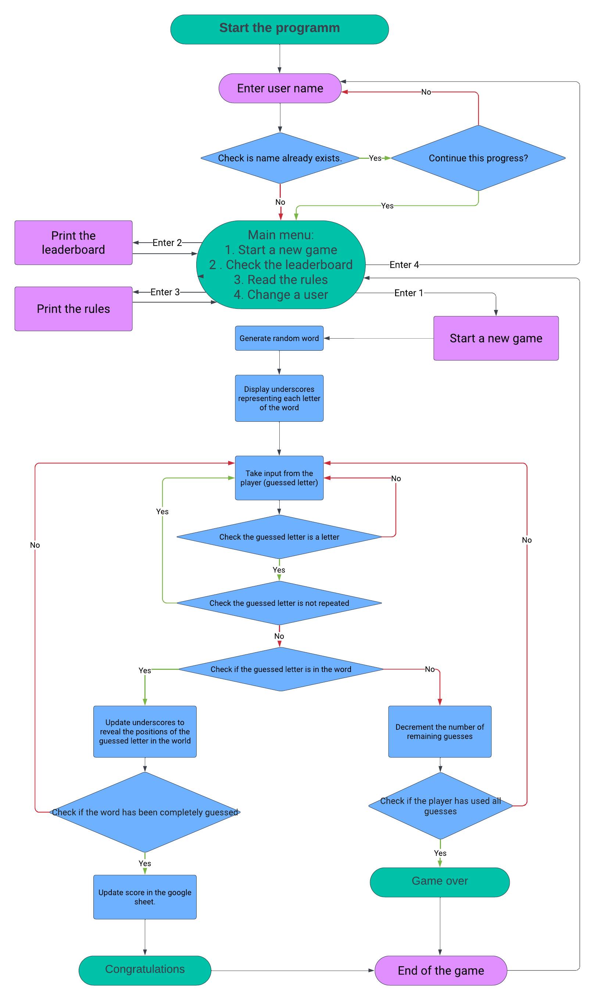
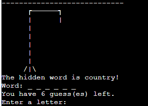
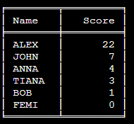
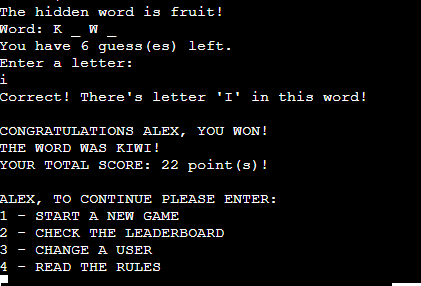

# The Hangman

Hangman is a popular game that was played with pen and paper before the era of computer technology. Now this is also possible thanks to the use of digital implementations on computers and mobile devices. It's a fun way to test vocabulary, spelling, and deduction skills.

Link for [Hangman Game](https://hangman-game-2024-352e05fc66fb.herokuapp.com/)

## Project Goals

The goal of the Hangman game, like most games, is to entertain the player and provide them with an engaging gaming experience. In the case of Hangman, it is a classic game where the player must guess the word chosen by the computer by sequentially guessing letters.

The main objectives of the Hangman game may include:

1. Entertainment: Providing players with the opportunity to have fun and enjoy their time. Hangman can be an enjoyable game that helps players distract themselves from everyday worries and enjoy the gaming process.

2. Enhancing Intellectual Skills: The game of Hangman can help players develop and improve their lexical and logical skills. Guessing letters and guessing the word requires analysis and decision-making based on the available information.

3. Competition: The game may involve an element of competition, especially if it allows players to compare their results with others. This can encourage players to improve their skills and achieve higher scores.

4. Building Bonds: Hangman can be a great game for family or friends to enjoy together, fostering stronger bonds among participants. Discussing the guessed words and hints can be a source of laughter and conversation.

Overall, the goal of the Hangman game is to create an engaging and entertaining experience for players that brings them enjoyment and positive emotions.

## Technologies

1. lucid.app - to create a flowchart.
2. Python - programming language used for the creation of the game.
3. VSCode - was used as the primary local IDE for coding.
4. GitHub - to store the project's code.
5. Heroku - to deploy my application.

## UX

### Strategy

1. Simplicity: The primary strategy for Hangman is to keep the game simple and intuitive. Users should be able to understand the rules and gameplay mechanics without needing extensive instructions.
2. Engagement: The game has been designed to keep players engaged and entertained throughout the entire gaming session.
3. Accessibility: Hangman is accessible to a wide range of players, including those with varying levels of gaming experience and abilities. This means designing the game interface with clear and easy-to-understand elements.
4. Feedback: Providing feedback to the player is crucial for a good user experience. The game should give clear feedback on each action taken by the player, such as whether their guess was correct or incorrect.

### Scope

1. Gameplay Mechanics: The core gameplay mechanics of Hangman involve guessing letters to uncover a hidden word. The scope of the game includes implementing these mechanics in a user-friendly and enjoyable manner.
2. The visual design of Hangman encompasses elements such as the gallows and the hidden word. The scope includes creating visually appealing and thematic assets that enhance the overall experience.

### Structure

Since this game works on the command line, information is displayed to the user gradually and depending on his request.
When the game begins, all that is known of the mystery word is the number of letters and. A guess involves suggesting a letter. When a guess is correct all occurrences of the suggested letter are revealed.
A successful guess incurs no penalty. An unsuccessful guess results in another stroke being added to the hanged man drawing

### Skeleton

To create a flowchart I used lucid.app.

### Surface

Due to this program being built for terminal use, there was not much design. I used basic keyboard letters and symbols for my gallow and hangman.

## Features

### Welcome block

The player is presented with a welcome screen and prompted to enter a name.

The program verifies if there is a player with the same name already registered. If found, it prompts whether you would like to resume your progress.

### Menu

After entering a name, the user is presented with a selection of further actions. He can start the game, view the leaderboard, read the rules, or change the username.

### Game

The secret word may relate to such topics: fruit, vegetable, animal, country, occupation and color. The topic displayed under the gallows. Underneath the user can see the underscores where the letters will populate with correct guesses and below this is where they will see the number of how many guesses left.

### Leaderboard

Users can check the game's leaderboard to see their position among other participants.

### Finish game

On completion of the game, win or lose, the user is given the start menu options.

### Rules of the game

If the user is not familiar with the rules of the game, he can read them by selecting the required menu item.

## Testing

### Manual testing

| Feature tested                                          | Expected outcome                                                                                                                                      | Actual outcome |
| ------------------------------------------------------- | ----------------------------------------------------------------------------------------------------------------------------------------------------- | -------------- |
| Enter name.                                             | The program verifies if there is a player with the same name already registered. If found, it prompts whether you would like to resume your progress. | As expected.   |
| In the start menu enter not 1, 2, 3 or 4.               | The message appears: "Please enter the correct input                                                                                                  | As expected.   |
| In the start menu enter 1.                              | The game starts.                                                                                                                                      | As expected.   |
| In the start menu enter 2.                              | Print the actual leaderboard.                                                                                                                         | As expected.   |
| In the start menu enter 3.                              | Print the rules.                                                                                                                                      | As expected.   |
| In the start menu enter 4.                              | Print enter your name.                                                                                                                                | As expected.   |
| In the game enter a number or symbol.                   | The message appears: "That's not a letter!" and ask again to enter the letter.                                                                        | As expected.   |
| In the game enter several letters.                      | The message appears: "Please enter just one letter!" and ask again to enter the letter.                                                               | As expected.   |
| In the game enter letter that has already been entered. | The message appears: "You've already entered this letter!" and ask again to enter the letter.                                                         | As expected.   |
| Enter letter which is in the secret word.               | The letter(s) appears instead of an underscore(s).                                                                                                    | As expected.   |
| Enter letter which is not in the secret word.           | A part of the hangman is drawn and the player loses one attempt.                                                                                      | As expected.   |
| After 6 incorrect guesses.                              | The drawing is completely ready and the game ends. You lose.                                                                                          | As expected.   |
| If there are no more underscores left.                  | The game ends, you won. The player's score increases by 1.                                                                                            | As expected.   |

### Python Validation

I validated my run.py file using [Code Institute's Python Linter](https://pep8ci.herokuapp.com/#).

### Bugs

Bugs and erros econountered during coding of project were solved through contiuned testing throught the development. Using print statements and through git terminal python3 run.py. Testing code to see what the code was doing and how it was responding as well as locating any errors that might be brought up in the problems part of git.
When I ran my Code through the [PEP8](https://pep8ci.herokuapp.com/#) I found such syntax errors:

- trailing whitespace;
- continuation line under-indented for visual indent;
- expected 2 blank lines, found 1;
- line too long.

All these errors have been fixed.

## Deployment

### Create Repository

1. Link to the [Python Essentials Template](https://github.com/Code-Institute-Org/p3-template).
2. Click green button "Use this template", then "Create a new repository".
3. Enter repository name and click "Create repository".

### Clone my repository from GitHub to VSCode

1. Click green button "<> Code" in the my repository on GitHub.
2. On the "HTTPS" tab, click on the clipboard icon to copy the URL.
3. In the VSCode app enter CTRL+SHIFT+G, then click "Clone repository" and paste the link.
4. Throughout development I used such git commands:
   - git add: to add the file(s) to the staging area before they are committed;
   - git commit -m “commit message”: to commit changes to the local repository queue, ready for the final step;
   - git push: to push all committed code to the remote repository on GitHub.

### Creating the Heroku app

This project was deployed using Code Institute's mock terminal for Heroku. Below are the steps I followed to be able to deploy the terminal to the website:

1. Create a new Heroku app on the Heroku website.
2. Create config vars:
   - on the _Settings_ tab click "Reveal Config Vars";
   - in the field for key enter "CREDS", all capital letters;
   - copy the entire creds.json file from our workspace and paste it into the value field;
   - click “Add”;
   - add another config var, key "PORT" and set this to "8000".
3. Add two buildpacks from the _Settings_ tab. The ordering is as follows:
   - `heroku/python`
   - `heroku/nodejs`
4. Connect the Heroku app to the repository on GitHub.
5. Enter the name repository, click Search and click Connect.
6. Click Deploy Branch.

## Credits

My first step was to watch some hangman game videos on YouTube, like this by [Shaun Halverson](https://www.youtube.com/watch?v=pFvSb7cb_Us&t=2s) or this one by [MobileDevSchool](https://www.youtube.com/watch?v=WV2zPAVRekY), to get an idea of how to set the game up. Then in preparation for my coding process, I created a flowchart to visualize the game logic. When the logic was clear, I started to code step-by-step.
